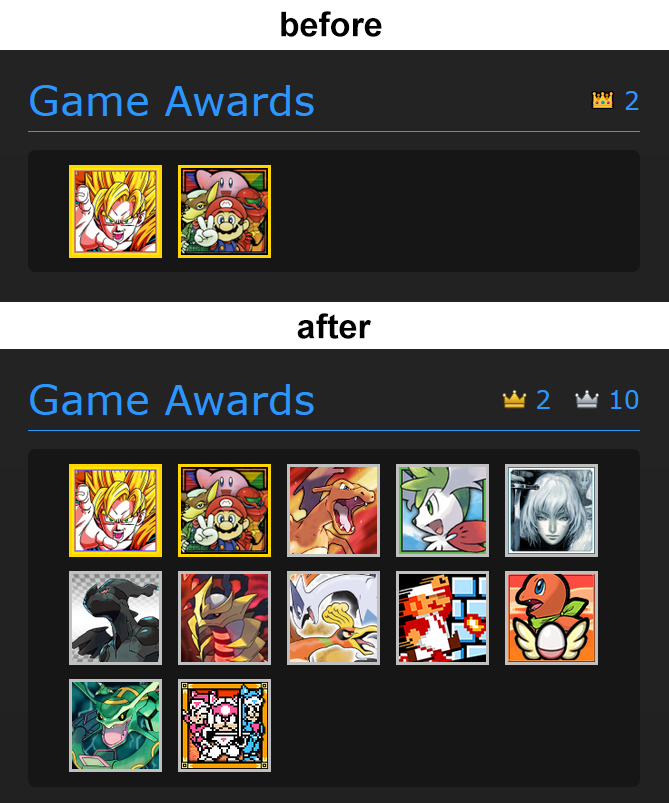

# RABG: Add Beaten Badges to RetroAchievements
Shows your beaten games alongside mastered games in the Game Awards section of RetroAchievements profile pages.

 

***

On a RetroAchievements user profile page, this extension:
1. Reads the "Completion Progress" list for every game marked as "beaten".
2. Sorts them by completion percentage (highest first).
3. Adds them to the "Game Awards" grid with a silver frame.
4. Adds a second counter with a silver crown icon for beaten games.

