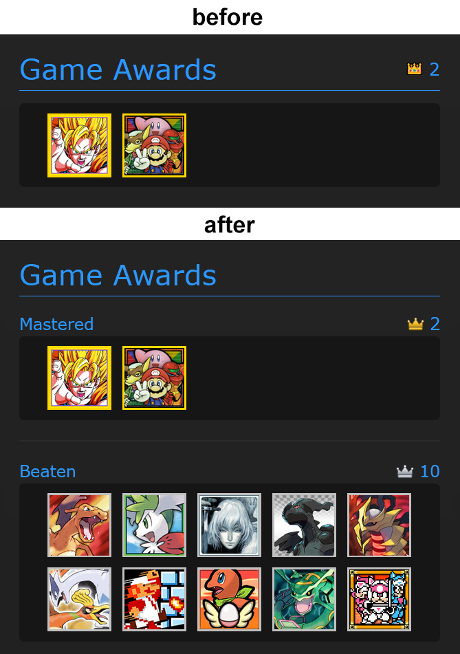
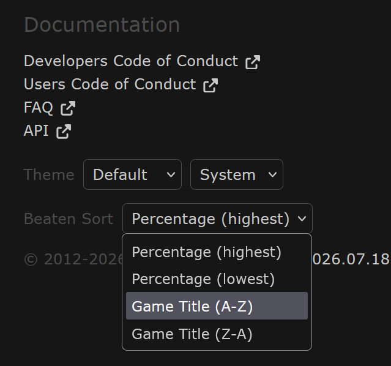

# RABG: Add Beaten Badges to RetroAchievements
Shows your beaten games alongside mastered games in the Game Awards section of RetroAchievements profile pages.

 

***

# How It Works?

On a RetroAchievements user profile page, this extension:
1. Reads the "Completion Progress" list for every game marked as "beaten".
2. Sorts them by completion percentage (highest first).
3. Adds them to the "Game Awards" grid with a silver frame.
4. Adds a second counter with a silver crown icon for beaten games.

At the very bottom of the page (i.e. the footer section of the website), there'll be a settings section that lets you adjust the way the beaten badges are sorted.

***

# Changelog

You can find the changelog [here](CHANGELOG.md).

***

# Known Issues

This extension can only display beaten games that already appear in "Completion Progress" section of a user profile. That section shows only a limited selection of games rather than all of them, so once a user plays a lot of titles, some beaten games will fall outside it and won't appear there.

Catching every beaten game would mean fetching and paginating through the separate progress pages (i.e. extra network requests, parsing multiple pages, and keeping it all in sync, etc.) which is far more complex and more likely to break as the site changes.
